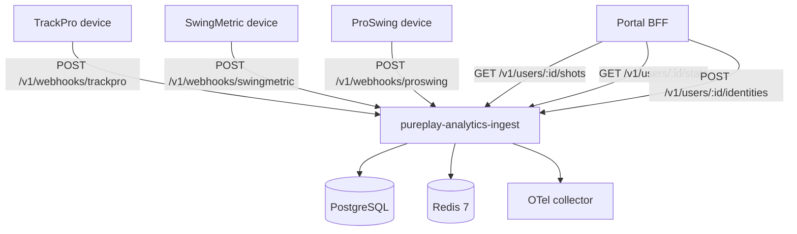
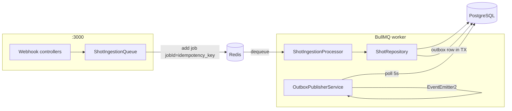
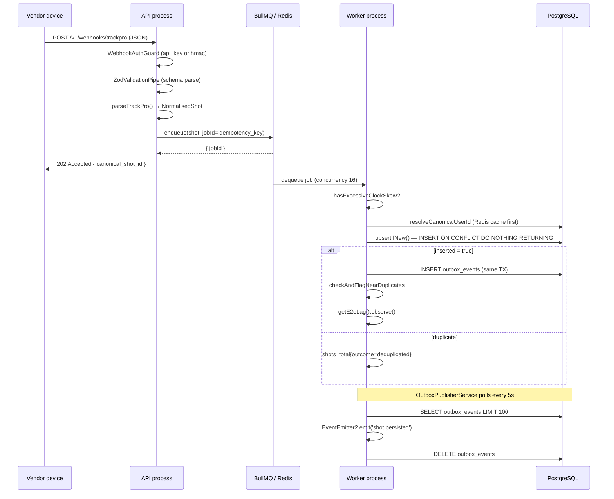
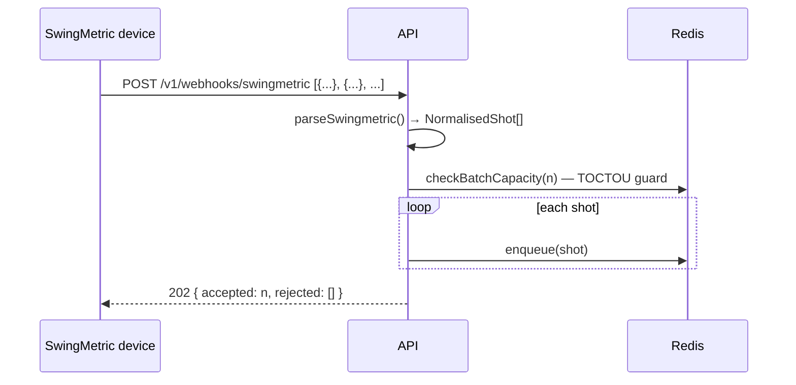
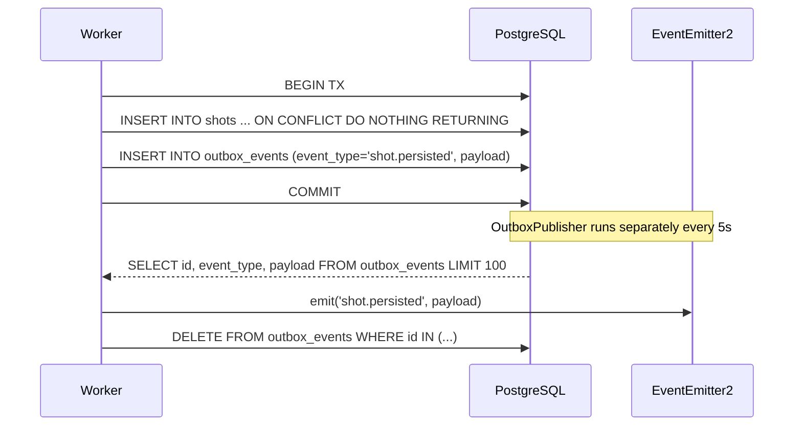
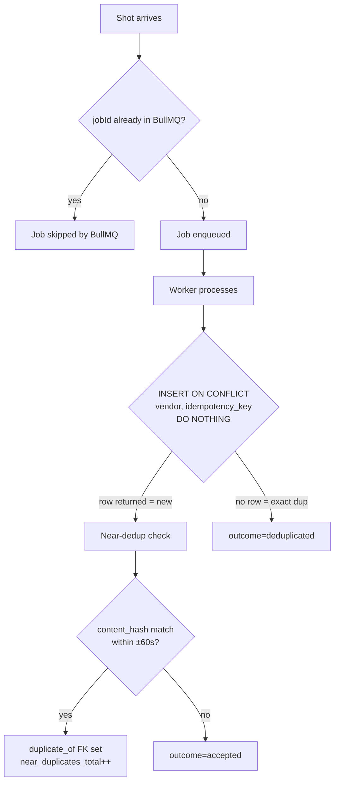
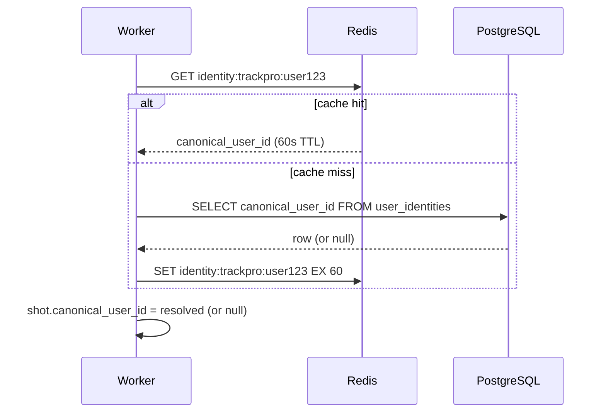

# Architecture Overview

## System context

Pureplay Analytics Ingest is a backend microservice that receives golf shot telemetry from three hardware vendors (TrackPro, SwingMetric, ProSwing), normalises and deduplicates the data, stores it in PostgreSQL, and exposes query/stats endpoints to the Portal BFF.

---

## Two-process architecture

The service is deployed as **two independent Node.js processes** compiled from the same codebase:

| Process | Entry point | Module | Role |
|---|---|---|---|
| API | `src/main.api.ts` | `AppModule` | Receives HTTP requests; enqueues shots |
| Worker | `src/main.worker.ts` | `WorkerModule` | Processes BullMQ jobs; writes to DB |

Separating the processes means:
- API latency is never blocked by slow DB writes.
- Worker can be scaled independently (more concurrency, more replicas).
- The outbox publisher runs only in the worker — no race between two publishers.

---

## Request lifecycle — single shot (TrackPro)

---

## Batch ingestion (SwingMetric)

SwingMetric sends batches of 1–500 shots in one POST.

The `checkBatchCapacity(n)` call reads the current queue depth once and rejects the whole batch if `depth + n > MAX_QUEUE_DEPTH`. Without this, a 500-shot batch can overflow by up to 499 because all per-shot depth reads happen before any write lands.

---

## Transactional outbox pattern

If the worker crashes between COMMIT and DELETE, the outbox row remains and the event re-fires on the next poll cycle. Consumers must be idempotent (they already are — shot ULID is the key).

---

## Deduplication — two layers

**Layer 1 — Exact dedup:** BullMQ `jobId = idempotency_key` prevents duplicate jobs from entering the queue. The database `UNIQUE(vendor, idempotency_key)` constraint is a second backstop.

**Layer 2 — Near dedup:** SHA-256 content hash over 7 normalised fields (see [functions/ingestion.md](../functions/ingestion.md#computecontenthash)). Shots with the same hash within ±60 seconds of each other are soft-flagged via `duplicate_of` FK. No rows are deleted.

---

## Identity resolution

If no mapping exists, `canonical_user_id` is stored as `null`. The Portal BFF registers the mapping later; `linkIdentity` backfills all matching shots in a fire-and-forget UPDATE after the transaction commits.
