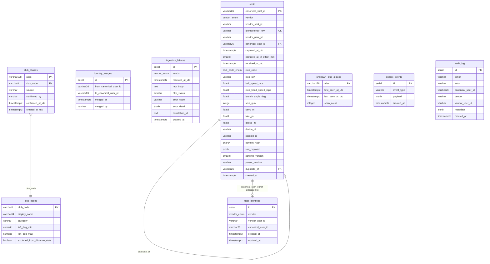

# Database Schema

All tables are defined in `src/shared/kysely/types.ts` and created by `migrations/001_init.sql`.

---

## Entity-relationship diagram



---

## Table reference

### `shots`

The core table. One row per unique `(vendor, idempotency_key)` pair.

| Column | Type | Notes |
|---|---|---|
| `canonical_shot_id` | `VARCHAR(26)` | ULID — generated by `ulidx.monotonicFactory()` |
| `vendor` | `vendor_enum` | `'trackpro' \| 'swingmetric' \| 'proswing'` |
| `vendor_shot_id` | `VARCHAR` | Vendor's own shot identifier (may be null) |
| `idempotency_key` | `VARCHAR` | Scheme varies per vendor (see Webhooks docs) |
| `vendor_user_id` | `VARCHAR` | Opaque string from the vendor |
| `canonical_user_id` | `VARCHAR(26)` | ULID from Portal BFF; null until identity is linked |
| `captured_at_utc` | `TIMESTAMPTZ` | When the shot was taken, normalised to UTC |
| `captured_at_tz_offset_min` | `SMALLINT` | Original UTC offset in minutes (preserved; nullable) |
| `received_at_utc` | `TIMESTAMPTZ` | When the API received the request |
| `club_code` | `club_code_enum` | Normalised club code (e.g. `'7I'`, `'PW'`, `'DR'`) |
| `club_raw` | `VARCHAR` | Original vendor string before normalisation |
| `ball_speed_mps` | `DOUBLE PRECISION` | Metres per second |
| `club_head_speed_mps` | `DOUBLE PRECISION` | Nullable (not all vendors provide) |
| `launch_angle_deg` | `DOUBLE PRECISION` | Degrees |
| `spin_rpm` | `INTEGER` | Nullable (TrackPro does not provide spin) |
| `carry_m` | `DOUBLE PRECISION` | Carry distance in metres |
| `total_m` | `DOUBLE PRECISION` | Total distance in metres (nullable) |
| `lateral_m` | `DOUBLE PRECISION` | Signed: negative = left, positive = right |
| `device_id` | `VARCHAR` | Nullable device identifier |
| `session_id` | `VARCHAR` | Nullable session identifier |
| `content_hash` | `CHAR(64)` | SHA-256 hex for near-dedup detection |
| `raw_payload` | `JSONB` | Full vendor payload — **never return from API** (PII) |
| `schema_version` | `SMALLINT` | Vendor schema version (1, 2, or 3) |
| `parser_version` | `VARCHAR` | Semver of the parser that produced this row |
| `duplicate_of` | `VARCHAR(26)` | ULID FK to canonical origin shot (soft near-dup flag) |
| `created_at` | `TIMESTAMPTZ` | DB insert timestamp |

**Unique constraints:** `(vendor, idempotency_key)`

**Indexes:** `captured_at_utc`, `vendor_user_id`, `canonical_user_id`, `content_hash`, `duplicate_of`

---

### `user_identities`

Maps vendor user IDs to canonical user IDs (managed by Portal BFF).

| Column | Type | Notes |
|---|---|---|
| `id` | `SERIAL` | Internal PK |
| `vendor` | `vendor_enum` | |
| `vendor_user_id` | `VARCHAR` | |
| `canonical_user_id` | `VARCHAR(26)` | ULID |
| `created_at` | `TIMESTAMPTZ` | |
| `updated_at` | `TIMESTAMPTZ` | Updated on re-link |

**Unique constraint:** `(vendor, vendor_user_id)` — one canonical user per vendor user.

---

### `identity_merges`

Append-only log of canonical user ID merges (Portal BFF operation; this service does not write here).

| Column | Type | Notes |
|---|---|---|
| `from_canonical_user_id` | `VARCHAR(26)` | Merged-from user |
| `to_canonical_user_id` | `VARCHAR(26)` | Surviving user |
| `merged_at` | `TIMESTAMPTZ` | |
| `merged_by` | `VARCHAR` | Actor identifier |

---

### `ingestion_failures`

Records shots that failed validation or processing. `raw_body` is PII-redacted before storage.

| Column | Type | Notes |
|---|---|---|
| `vendor` | `vendor_enum` | |
| `received_at_utc` | `TIMESTAMPTZ` | |
| `raw_body` | `TEXT` | PII-redacted JSON string |
| `http_status` | `SMALLINT` | HTTP status at point of failure (0 for worker failures) |
| `error_code` | `VARCHAR` | e.g. `CLOCK_SKEW_EXCESSIVE`, `PAYLOAD_VALIDATION_FAILED` |
| `error_detail` | `JSONB` | Structured detail (e.g. `{ captured_at_utc }`) |
| `correlation_id` | `TEXT` | Request correlation ID for tracing |

---

### `club_codes`

Seed data for all valid club codes. See `migrations/002_club_data.sql`.

| Column | Type | Notes |
|---|---|---|
| `club_code` | `VARCHAR(8)` PK | e.g. `'DR'`, `'7I'`, `'PW'`, `'PT'` |
| `display_name` | `VARCHAR(64)` | e.g. `'Driver'`, `'7 Iron'` |
| `category` | `VARCHAR` | `wood \| hybrid \| iron \| wedge \| putter \| unknown` |
| `loft_deg_min` | `NUMERIC(4,1)` | Nullable |
| `loft_deg_max` | `NUMERIC(4,1)` | Nullable |
| `excluded_from_distance_stats` | `BOOLEAN` | True for putters |

---

### `club_aliases`

Normalisation map from vendor raw strings to canonical club codes.

| Column | Type | Notes |
|---|---|---|
| `alias` | `VARCHAR(128)` PK | Lowercase, trimmed (e.g. `'7iron'`, `'pitching wedge'`) |
| `club_code` | `VARCHAR(8)` FK | → `club_codes.club_code` |
| `source` | `VARCHAR` | `seed \| ops \| auto_suggested` |
| `confirmed_by` | `VARCHAR(255)` | Nullable operator identifier |
| `confirmed_at_utc` | `TIMESTAMPTZ` | Nullable |

---

### `unknown_club_aliases`

Tracks unrecognised club strings for manual review.

| Column | Type | Notes |
|---|---|---|
| `alias` | `VARCHAR(128)` PK | |
| `first_seen_at_utc` | `TIMESTAMPTZ` | Auto-set on first insert |
| `last_seen_at_utc` | `TIMESTAMPTZ` | Updated on each occurrence |
| `seen_count` | `INTEGER` | Incremented on each occurrence |

---

### `outbox_events`

Transactional outbox for `shot.persisted` events. Written atomically with shot insert; consumed and deleted by `OutboxPublisherService` every 5 seconds.

| Column | Type | Notes |
|---|---|---|
| `event_type` | `VARCHAR` | `'shot.persisted'` |
| `payload` | `JSONB` | `NormalisedShot` minus `raw_payload` |

---

### `audit_log`

Append-only audit trail for identity operations.

| Column | Type | Notes |
|---|---|---|
| `action` | `VARCHAR` | `IDENTITY_LINK \| IDENTITY_UNLINK \| IDENTITY_LIST` |
| `actor` | `VARCHAR` | Service or operator identifier |
| `canonical_user_id` | `VARCHAR(26)` | Nullable |
| `vendor` | `VARCHAR` | Nullable |
| `vendor_user_id` | `VARCHAR` | Nullable |
| `metadata` | `JSONB` | Extra context (e.g. `{ result_count }`) |

---

## PostgreSQL ENUMs

```sql
CREATE TYPE vendor_enum AS ENUM ('trackpro', 'swingmetric', 'proswing');
CREATE TYPE club_code_enum AS ENUM ('DR', '3W', '5W', '7W', '2H', '3H', '4H', '5H',
  '2I', '3I', '4I', '5I', '6I', '7I', '8I', '9I',
  'PW', 'GW', 'SW', 'LW', 'PT', 'UK');
```

TypeScript union types mirror these ENUMs. Never pass a plain string where `Vendor` or `ClubCode` is expected.

---

## Migrations

| File | Description |
|---|---|
| `migrations/001_init.sql` | All tables, ENUMs, indexes, `ingestion_failures.correlation_id` column |
| `migrations/002_club_data.sql` | `club_codes` and `club_aliases` seed data |
| `migrations/003_identity_perf.sql` | Performance indexes on `user_identities` |

Migrations are run at startup when `RUN_MIGRATIONS=true`, via the character-by-character SQL splitter in `src/shared/kysely/migration-runner.ts`. See [functions/shared.md](../functions/shared.md#migration-runner) for the splitter behaviour.
