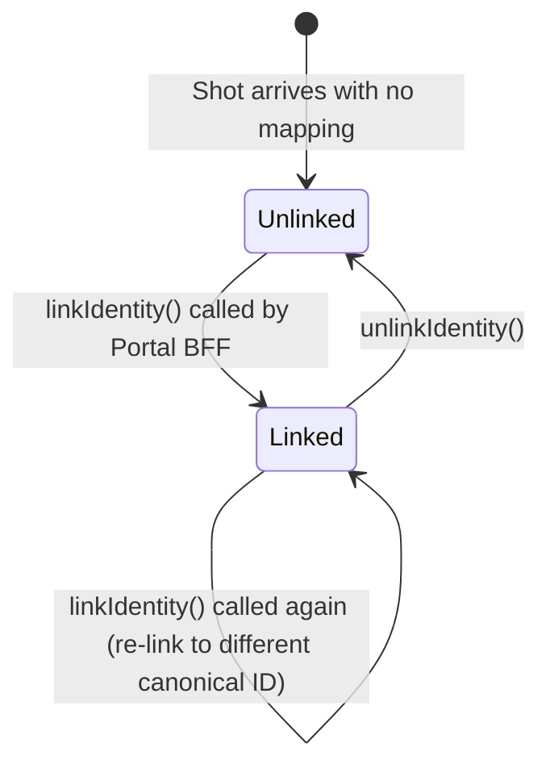

# Identity Functions

**File:** `src/identity/identity.service.ts`

`IdentityService` manages the mapping between vendor user IDs and canonical user IDs. It is fully implemented — not a stub.

---

## Overview



Cache keys:
- `identity:{vendor}:{vendor_user_id}` → `canonical_user_id` string (TTL 60s)
- `identity-list:{canonical_user_id}` → JSON array of `VendorIdentity` (TTL 30s)

---

## `resolveCanonicalUserId(vendor, vendorUserId)`

```typescript
async resolveCanonicalUserId(vendor: string, vendorUserId: string): Promise<string | null>
```

Called by `ShotIngestionProcessor` on every processed shot. Hot path — must be fast.

**Algorithm:**
1. Validate `vendor` is in `VALID_VENDORS` — return `null` for unknown vendors immediately.
2. `redis.get('identity:{vendor}:{vendor_user_id}')`
   - Hit: return `cached` (empty string `''` means "cached null" — no mapping exists)
   - Miss: continue
3. `SELECT canonical_user_id FROM user_identities WHERE vendor = ? AND vendor_user_id = ?`
4. Cache result (or `''` for null) with `EX IDENTITY_CACHE_TTL_S (60)`.
5. Return `canonical_user_id` or `null`.

**Why empty string for null:** Redis `GET` returns `null` on a key miss, and `''` on a cached empty value. This distinguishes "key not in Redis" (cache miss → go to DB) from "key in Redis, value is null" (cached no-mapping → don't go to DB).

---

## `linkIdentity(vendor, vendorUserId, canonicalUserId, actor)`

```typescript
async linkIdentity(
  vendor: Vendor,
  vendorUserId: string,
  canonicalUserId: string,
  actor?: string,
): Promise<VendorIdentity>
```

**Transaction (short, 2 round-trips):**
1. `INSERT INTO user_identities ... ON CONFLICT (vendor, vendor_user_id) DO UPDATE SET canonical_user_id = ?, updated_at = ? RETURNING *`
2. `INSERT INTO audit_log (action='IDENTITY_LINK', actor, canonical_user_id, vendor, vendor_user_id)`

**After transaction commits:**
3. `redis.del('identity:{vendor}:{vendor_user_id}', 'identity-list:{canonical_user_id}')` — cache eviction
4. Fire-and-forget: `UPDATE shots SET canonical_user_id = ? WHERE vendor = ? AND vendor_user_id = ? AND canonical_user_id IS NULL`

The backfill runs **outside the transaction** to avoid holding the `user_identities` row lock during a potentially slow table scan. If it fails, the next `linkIdentity` call will re-attempt it.

---

## `listByCanonicalUser(canonicalUserId, actor)`

```typescript
async listByCanonicalUser(canonicalUserId: string, actor?: string): Promise<VendorIdentity[]>
```

**Algorithm:**
1. `redis.get('identity-list:{canonical_user_id}')`
   - Hit: parse JSON, fire audit log (fire-and-forget), return
   - Miss: continue
2. `SELECT * FROM user_identities WHERE canonical_user_id = ? ORDER BY created_at ASC`
3. Cache JSON with `EX IDENTITY_LIST_CACHE_TTL_S (30)` (fire-and-forget, never blocks response)
4. Fire-and-forget audit log write
5. Return rows

The audit log write is fire-and-forget on both the cache-hit and cache-miss paths. SOC2 CC6 / ISO A.8.15 require capturing access; the timing within a few seconds is acceptable and prevents a slow INSERT from adding latency to every GET response.

---

## `unlinkIdentity(vendor, vendorUserId, canonicalUserId, actor)`

```typescript
async unlinkIdentity(
  vendor: Vendor,
  vendorUserId: string,
  canonicalUserId: string,
  actor?: string,
): Promise<void>
```

**Transaction:**
1. `DELETE FROM user_identities WHERE vendor = ? AND vendor_user_id = ? AND canonical_user_id = ?`
   - If `numDeletedRows === 0n` → throw `IdentityNotFoundError` (→ 404)
2. `INSERT INTO audit_log (action='IDENTITY_UNLINK', ...)`

**After transaction:**
3. `redis.del(...)` — evicts both caches

**Does not** update `shots.canonical_user_id` on unlink. Existing shots retain their canonical user ID for audit trail integrity.

---

## VendorIdentity interface

```typescript
export interface VendorIdentity {
  id: number;
  vendor: Vendor;
  vendor_user_id: string;
  canonical_user_id: string;
  created_at: string;
  updated_at: string;
}
```

---

## AuditLogService

**File:** `src/shared/audit/audit-log.service.ts`

```typescript
async record(
  entry: {
    action: 'IDENTITY_LINK' | 'IDENTITY_UNLINK' | 'IDENTITY_LIST';
    actor: string;
    canonical_user_id?: string;
    vendor?: string;
    vendor_user_id?: string;
    metadata?: Record<string, unknown>;
  },
  trx?: Kysely<Database>,  // optional — pass to run inside caller's TX
): Promise<void>
```

Accepts an optional Kysely `trx` parameter. When provided, the audit write runs inside the caller's transaction — atomically with the identity mutation. When omitted, uses the shared `db` connection (fire-and-forget use case, e.g. `listByCanonicalUser`).
